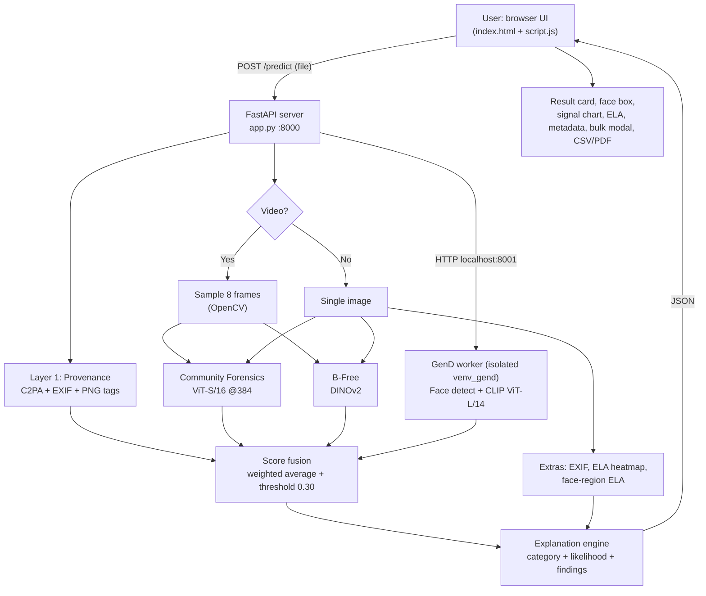

# Universal Synthetic Media Detector (USMD)

> Advanced multi-model AI forensics for **images and videos**: detects AI-generated media, face-swap deepfakes and edited content, and **explains in plain language why**.

---

## Table of Contents
1. [What this project does](#1-what-this-project-does)
2. [Feature list](#2-feature-list)
3. [End-to-end architecture](#3-end-to-end-architecture)
4. [The detection models](#4-the-detection-models)
5. [How scores are calculated](#5-how-scores-are-calculated)
6. [How the explanation is generated](#6-how-the-explanation-is-generated)
7. [Frontend (UI) walkthrough](#7-frontend-ui-walkthrough)
8. [API reference](#8-api-reference)
9. [Project structure](#9-project-structure)
10. [How to run](#10-how-to-run)
11. [Accuracy and threshold calibration](#11-accuracy-and-threshold-calibration)
12. [Limitations (please read)](#12-limitations-please-read)
13. [Development timeline](#13-development-timeline)
14. [Credits](#14-credits)

---

## 1. What this project does

You upload an image or video (or many at once). The system:

1. Reads hidden **provenance data** in the file (C2PA credentials, EXIF, AI-tool tags).
2. Runs **three AI detectors** on the pixels (and on the face, if one is found).
3. **Combines** their scores into one final probability that the media is fake.
4. Tells you **Real or Fake**, a **confidence**, a **category** (e.g. "AI-Generated", "Face Replaced / Swapped"), a **likelihood level**, and a **written explanation** of the evidence.
5. Shows extra **forensic views**: a signal chart, an ELA heatmap, a metadata table and a face box drawn on the image.

The three kinds of fake it can tell apart:

| Kind of fake | Example | What catches it |
|---|---|---|
| **Fully AI-generated** | Midjourney / Stable Diffusion / DALL-E image | Community Forensics, B-Free |
| **Face swap / face replaced** | Real video, different person's face | GenD (face model) |
| **Edited / inpainted** | Real photo with AI-edited regions | B-Free, ELA check |

---

## 2. Feature list

### Detection
| Feature | What it does | How it is implemented |
|---|---|---|
| **Image detection** | Scores any JPG/PNG/WEBP for AI generation. | `CommForDetector` and `BFreeDetector` in `detectors/pixel.py`. |
| **Video detection** | Scans videos (MP4, AVI, MOV, MKV, WEBM). | `detectors/video.py` samples **8 frames evenly across the whole clip** with OpenCV; each frame is scored, then averaged. |
| **Face-swap detection** | Checks the face separately for deepfake blending/identity artifacts. | OpenCV Haar cascade finds the face, crop goes to **GenD** (CLIP ViT-L/14) in `gend_worker.py`. |
| **Provenance check** | Finds C2PA credentials, AI-tool names and PNG prompt tags (e.g. Stable Diffusion `parameters`). | `detectors/provenance.py` (uses `c2pa-python`, Pillow EXIF/PNG chunks). |
| **Test-time augmentation** | Makes the Community Forensics score more stable. | Averages 3 views: center crop, horizontally-flipped crop, full-image squash (`_predict_tta`). |
| **Video temporal features** | Measures optical-flow warp error, high-frequency energy, flicker. | `detectors/temporal.py` (returned as raw data, **not** part of the verdict yet). |

### Explainability (the "why")
| Feature | What it does | How it is implemented |
|---|---|---|
| **Written forensic explanation** | A category, a summary sentence and bullet-point findings. | `build_explanation()` in `app.py` (rule-based on model scores). |
| **Likelihood level** | "Very likely / Likely / Possible / Unlikely". | Based on how far the strongest signal is above the threshold. |
| **Face-region analysis** | Says when the face looks manipulated but the scene looks real. | Compares GenD (face) against CommFor/B-Free (whole image). |
| **Face box overlay** | Draws a box on the face: red = suspected, amber = no swap signal, green = natural. | Worker returns a normalized face box; `faceBoxHtml()` in `script.js` draws it. |
| **Face-only ELA check** | Detects a pasted/regenerated face by compression mismatch. | `face_region_ela()` compares ELA error inside vs outside the face box. |

### Forensic views
| Feature | What it does | How it is implemented |
|---|---|---|
| **Signal chart** | Videos: fake probability per frame. Images: per-model scores. Threshold line at 30%. | HTML5 `<canvas>`, `drawChart()` in `script.js`. |
| **ELA heatmap** | Error Level Analysis image. Bright areas recompress differently = possible edit. | `make_ela()` re-saves the image as JPEG (q=90) and amplifies the difference. |
| **Metadata viewer** | EXIF camera data, software and PNG text tags. | `extract_exif()` in `app.py`. |

### Workflow and UI
| Feature | What it does | How it is implemented |
|---|---|---|
| **Bulk analysis** | Analyze many files in one run with progress bar and live Real/Fake tally. | `analyzeBulk()` in `script.js` calls `/predict` once per file. |
| **Bulk detail report** | Click any tile to open a full report pop-up (verdict, explanation, models, chart, ELA, metadata). | `openDetail()` modal in `script.js`. |
| **CSV export** | Download all bulk results as a spreadsheet. | `exportCsv()` in `script.js`. |
| **PDF forensic report** | Print a clean report. | `window.print()` with a print stylesheet. |
| **Feedback buttons** | Mark each verdict Correct/Wrong for later review. | `/feedback` endpoint stores labeled samples. |
| **Premium UI** | Glassmorphism design, laser scan animation, step-by-step progress. | Vanilla HTML/CSS/JS (no framework). |

---

## 3. End-to-end architecture



### Why GenD runs as a separate service
GenD needs a different `transformers` version than the other models. Mixing them in one Python environment breaks both. So GenD lives in its own virtual environment (`venv_gend`) and runs as a small FastAPI service on port **8001**. The main app starts it automatically at startup (`gend_client.start()`) and stops it on shutdown. If `venv_gend` is missing, the app still works using the other two models.

### Request flow, step by step
1. Browser sends the file to `POST /predict`.
2. **Provenance** is checked first (fast, reads file records).
3. The file is sent to the **GenD worker**, which returns a face score and face box (or "no face").
4. **Images:** opened with Pillow; EXIF extracted; ELA heatmap generated. **Videos:** 8 frames sampled.
5. **Community Forensics** and **B-Free** score the image or each frame.
6. Scores are **fused** into the final score (see next section).
7. The **explanation engine** builds the written report.
8. Server returns one JSON object; the UI renders everything.

---

## 4. The detection models

| Layer | Model | Type | What it is good at |
|---|---|---|---|
| 1 | **Provenance** | Metadata reader | Files that openly declare AI origin (C2PA, tool names, SD prompts). Cannot prove "real". |
| 2 | **Community Forensics (CVPR 2025)** | ViT-S/16 @ 384px, trained on images from 4,803 generators | Fully AI-generated images (GAN and diffusion fingerprints). |
| 2 | **B-Free (2025)** | DINOv2 "bias-free" Vision Transformer | Structural anomalies, inpainting and edits, generalizes to new generators. |
| 3 | **GenD (WACV 2026)** | CLIP ViT-L/14 face detector | Face swaps and face reenactment. Runs on face crops only. |

All models output **P(fake)**, a number from 0 to 1.

---

## 5. How scores are calculated

### 5.1 Per-model scores

**Community Forensics** (`CommForDetector`)
1. Image is converted to RGB and resized to 440px, then center-cropped to 384x384.
2. Three views are made: the center crop, its horizontal flip, and the whole image squashed to 384x384.
3. Each view goes through the ViT; the output logit is turned into a probability with a **sigmoid**.
4. **Score = average of the 3 probabilities.**

**B-Free** (`BFreeDetector`)
1. Image is normalized with the model's own transform.
2. The network outputs a logit (for 2-class output: `logit = out[1] - out[0]`).
3. **Score = sigmoid(logit).**

**GenD** (`gend_worker.py`)
1. OpenCV Haar cascade finds the **largest face**.
2. The face is cropped with a 30% margin and preprocessed by the CLIP feature extractor.
3. Model output is passed through **softmax**; **score = probability of the "fake" class**.
4. For video: face crops from up to 8 frames; **score = mean over frames**.
5. If no face is found: score is `None` and GenD is not used.

**Provenance**
- If C2PA / EXIF / PNG tags declare AI generation: `prov_score = 1.0`, otherwise `0.0`.
- A missing tag means "unknown", never "real".

**Video**: Community Forensics and B-Free are computed per frame, then `avg_c = mean(frames)` and `avg_b = mean(frames)`.

### 5.2 Final score (fusion)

The weights depend on whether a face was found:

| Situation | Formula |
|---|---|
| **Face found** | `final = 0.33 x CommFor + 0.33 x B-Free + 0.34 x GenD` |
| **No face** | `final = 0.50 x CommFor + 0.50 x B-Free` |
| **Provenance says AI** | `final = max(final, 0.99)` (strong evidence overrides pixels) |

### 5.3 Decision

```
FAKE  if  final_score > 0.30
REAL  otherwise
confidence = final_score          (if Fake)
confidence = 1 - final_score      (if Real)
```

### 5.4 Worked example (the `image_03.png` case)

| Model | Score |
|---|---|
| Community Forensics | 93% |
| B-Free | 1% |
| GenD (face) | 14% |
| Provenance | 0% |

`final = 0.33 x 0.93 + 0.33 x 0.01 + 0.34 x 0.14 = 0.358` which is above `0.30`, so the verdict is **FAKE** (confidence 35.8%).

Note the explanation: the face model scored low because a **fully generated face has no swap seam**, but Community Forensics caught the generator fingerprint, so the category is "AI-Generated", not "face swap".

> The small final-score number is normal: the threshold is deliberately low (0.30), tuned to catch compressed or subtle fakes. See [Section 11](#11-accuracy-and-threshold-calibration).

### 5.5 Optional calibration
`detectors/calibration.py` can fit a small logistic regression on your Correct/Wrong feedback. It is **off by default** (a model fitted on few samples overfits). Enable with the environment variable `DEEPFAKE_USE_CALIBRATION=1`.

---

## 6. How the explanation is generated

`build_explanation()` in `app.py` is a transparent **rule-based** engine (no extra AI), so every statement can be traced to a score.

**Per-model findings** (each added when that model's score is above 0.30):
- GenD high: facial blending/identity artifacts, typical of face-swap.
- Community Forensics high: generator fingerprints, typical of fully AI-generated images.
- B-Free high: synthetic artifacts, possible inpainting or editing.
- Provenance: file declares AI origin.

**Category rules** (when the verdict is Fake):

| Condition | Category |
|---|---|
| Provenance declares AI | AI-Generated (declared) |
| Face high, pixel models low | Face Replaced / Swapped |
| Face high and pixel models high | Deepfake / AI-Generated |
| Only Community Forensics high | AI-Generated |
| Only B-Free high | Edited / Manipulated |
| Anything else | Synthetic or Manipulated |

**Likelihood level** from `margin = strongest_signal - 0.30`:

| Margin | Level |
|---|---|
| greater than 0.40 (or provenance AI) | Very likely |
| greater than 0.20 | Likely |
| otherwise | Possible |
| Real verdict | Unlikely to be manipulated |

**Face-region logic**
- Face model high but whole-image models low: "face region manipulated, scene authentic" (face replaced).
- Face-only ELA ratio outside `0.6 to 1.6`: "compression in face differs from background" (pasted face hint).
- Face model low but verdict Fake: explains that a fully generated face can pass face-swap checks.

---

## 7. Frontend (UI) walkthrough

Plain HTML, CSS and JavaScript (no framework), served by FastAPI from `static/`.

- **Left panel:** drag-and-drop upload, preview with face box, **Analyze** button, live bulk summary, evaluation report, CSV export.
- **Right panel:** animated analysis steps, verdict circle, score bar, explanation box, per-model cards, forensic tabs.
- **Single file:** full result card with Signal Chart / ELA / Metadata tabs.
- **Bulk (many files):** grid of tiles with a verdict and category badge. **Click a tile** to open the full report pop-up (Esc or click outside to close).

---

## 8. API reference

### `POST /predict`
Upload one file as `multipart/form-data` (field `file`). Returns:

| Field | Meaning |
|---|---|
| `prediction` | `"Fake"` or `"Real"` |
| `score` | Final fused score (0 to 1) |
| `confidence` | Percentage shown in the UI |
| `commfor_score`, `bfree_score`, `gend_score`, `prov_score` | Per-model scores (`gend_score` is null if no face) |
| `faces_found` | Number of face crops analyzed |
| `frames_analyzed` / `frame_scores` | Video frames used and per-frame scores |
| `explanation` | `{category, summary, findings[], likelihood}` |
| `face_box` | Normalized `[x, y, w, h]` of the face (images) |
| `region` | `{ela_ratio, ela_mismatch}` face vs background ELA |
| `ela` | Base64 ELA heatmap (images) |
| `exif` | Metadata dictionary |
| `temporal` | Raw video temporal measurements |

### `POST /feedback`
Stores labeled samples (`commfor`, `bfree`, `is_fake`) for later review. Does not change live predictions.

---

## 9. Project structure

```
Deepfake/
├── README.md                  <- this file
├── run.bat                    <- one-click start (Windows)
├── requirements.txt
├── evaluate.py, test_*.py     <- evaluation and test scripts
└── UniversalFakeDetect/
    ├── app.py                 <- FastAPI server, fusion, explanation engine
    ├── gend_worker.py         <- GenD face microservice (runs in venv_gend, port 8001)
    ├── detectors/
    │   ├── pixel.py           <- Community Forensics + B-Free
    │   ├── provenance.py      <- C2PA / EXIF / PNG tag checks
    │   ├── video.py           <- 8-frame sampling
    │   ├── temporal.py        <- optical-flow temporal features
    │   ├── calibration.py     <- optional feedback calibration
    │   └── gend_client.py     <- talks to the GenD worker
    └── static/
        ├── index.html         <- layout
        ├── style.css          <- glassmorphism design
        └── script.js          <- upload, analysis, charts, modal
```

---

## 10. How to run

**Option 1 (Windows, easiest):** double-click `run.bat`. It installs dependencies and starts the server.

**Option 2 (terminal / manual setup):**

If you cloned this repository from GitHub, follow these steps to recreate the environments (large weight files and virtual environments are not stored on GitHub).

1. **Install main dependencies**:
```bash
pip install -r requirements.txt
```

2. **Recreate GenD environment (required for face-swap detection)**:
```bash
python -m venv venv_gend
venv_gend\Scripts\pip install -r requirements_gend.txt
```

3. **Model Weights**:
- **Community Forensics and GenD** weights download automatically from Hugging Face on the first run.
- **B-Free weights** (`model_epoch_best.pth` and `config.yaml`) should be placed in `UniversalFakeDetect/detectors/B-Free/code/weights/BFREE_dino2reg4/`. If you are pushing to GitHub, use **Git LFS** for these files as they exceed 100MB.

4. **Start the server**:
```bash
cd UniversalFakeDetect
uvicorn app:app --port 8000
```
Open **http://localhost:8000**. Wait for "Models ready." in the console before uploading. The GenD worker starts automatically on port 8001 if `venv_gend` exists; otherwise, the face layer is skipped.

---

## 11. Accuracy and threshold calibration

- The older FFT and edge-noise detectors failed on modern (2024/2025) AI media, so they were replaced by Vision Transformer models.
- The decision threshold was swept over a custom real/fake test set. **0.30** gave the best balance, catching compressed or low-quality fakes while keeping false positives on real images low.
- Result on our internal benchmark: **about 95% accuracy**.

> This figure comes from our own test set, not an independent benchmark. Accuracy will vary with the media you test.

---

## 12. Limitations (please read)

- **It is a probability, not proof.** Results are strong evidence, not a legal verdict.
- **Explanations are inferences** from which models fired. "Face replaced" means likely, not certain.
- **Face detection is frontal-only** (Haar cascade); side-on or small faces may get no face analysis.
- **Face box and face ELA are image-only**; videos get the face score but no box.
- **ELA is a hint**: heavy compression, resizing and filters can look suspicious on real images.
- **Missing metadata is not evidence**: messaging apps and screenshots strip it.
- **Face-swap detectors can miss fully generated faces**; that is why the whole-image models matter.
- Video temporal features are measured but **not yet used in the verdict**.

---

## 13. Development timeline

1. **Audit:** benchmarked the legacy code; found high failure rates on modern deepfakes.
2. **Model upgrade:** replaced FFT/edge models with Community Forensics and B-Free (2025 ViTs).
3. **Threshold calibration:** swept thresholds on test data; chose 0.30.
4. **UI revamp:** premium glassmorphism frontend with scan animation.
5. **Video support:** OpenCV 8-frame sampling across the whole clip.
6. **GenD microservice:** isolated face detector to avoid dependency conflicts.
7. **Ensemble:** merged all signals into one dynamic fusion.
8. **Explainability:** written explanations, categories, likelihood levels.
9. **Forensic tools:** signal chart, ELA heatmap, metadata viewer, face box, face-region analysis.
10. **Bulk workflow:** clickable full reports, CSV export, PDF report.

---

## 14. Credits
- [B-Free](https://arxiv.org/abs/2410.02758): Bias-Free Vision Transformer for synthetic image detection
- [Community Forensics](https://huggingface.co/OwensLab/commfor-model-384): universal image forensics (CVPR 2025)
- [GenD](https://github.com/yermandy/GenD): Generalizable Deepfake Detection (WACV 2026)
- [UniversalFakeDetect](https://utkarshojha.github.io/universal-fake-detection/): original CVPR 2023 codebase this project started from
